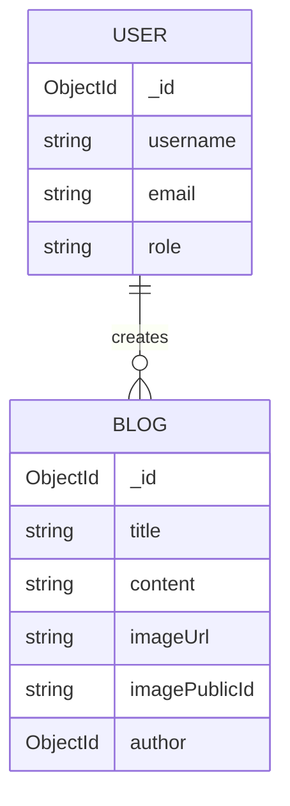
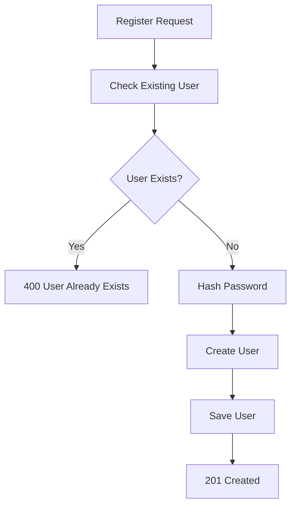
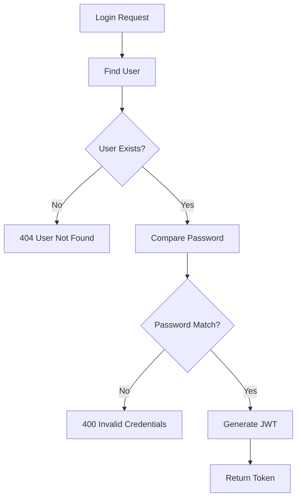
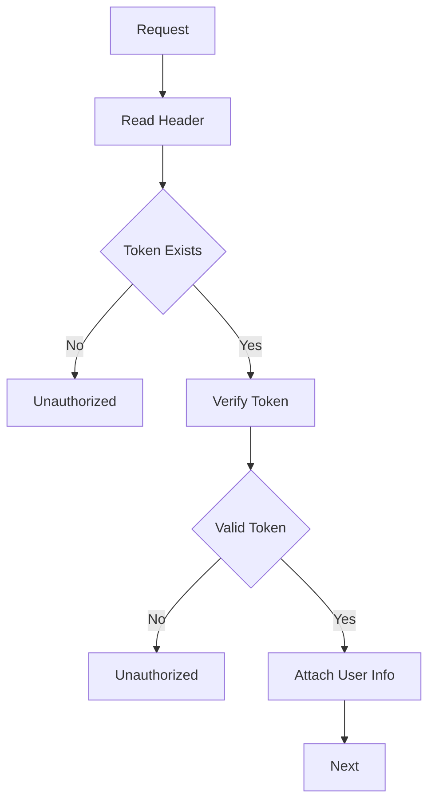
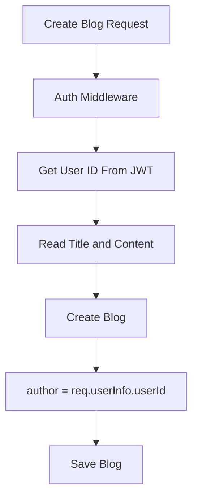
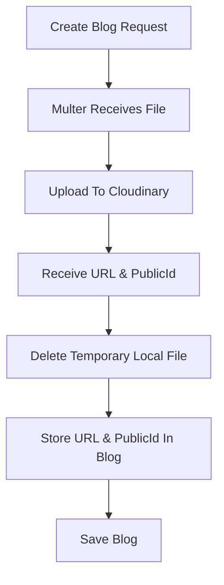
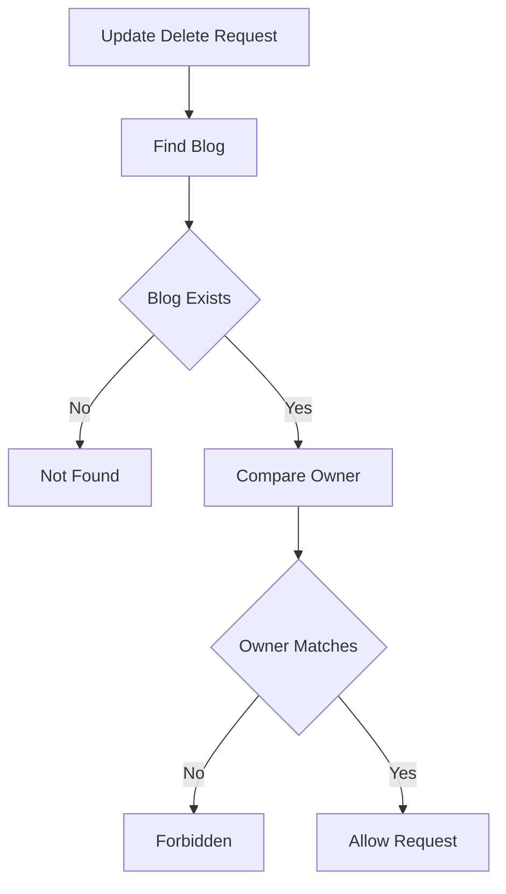
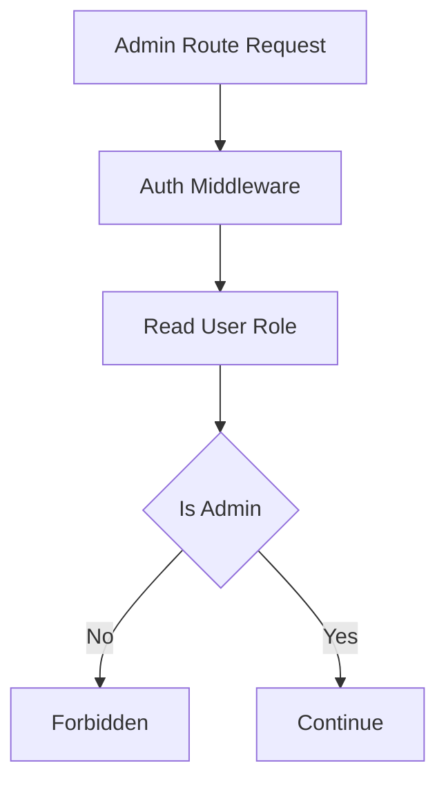
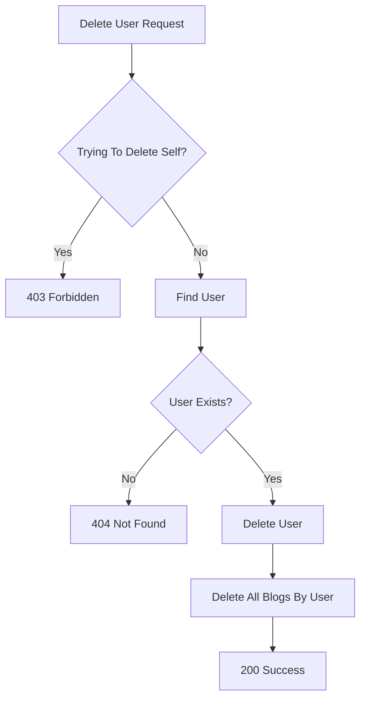

# Blog App Backend API

### From "What is ObjectId?" to Building Authentication, Authorization & Admin Controls

## Introduction

This project started as a simple backend blog application.

Initially, my goal was straightforward:

* Register users
* Login users
* Create blogs

However, while building it, I discovered that backend development is much more about designing data flow and responsibilities than writing CRUD operations.

This project became my first practical experience with:

* Authentication
* Authorization
* Ownership Validation
* Role Based Access Control
* MongoDB Relationships
* Middleware Architecture

More importantly, it helped me understand **why these concepts exist** rather than simply using them.

---

# Tech Stack

* Node.js
* Express.js
* MongoDB
* Mongoose
* JWT
* bcryptjs
* Multer
* Cloudinary

---

# Project Features

## Authentication

* User Registration
* User Login
* Password Hashing
* JWT Generation
* Protected Routes

## Blog Management

* Create Blog
* Upload Blog Images
* Get All Blogs
* Get Blog By ID
* Update Blog
* Replace Blog Images
* Delete Blog
* Delete Associated Cloudinary Images

## Authorization

* Users can only edit their own blogs
* Users can only delete their own blogs

## Admin Features

* View All Users
* Delete Any User
* Delete User's Blogs Automatically
* Role Based Access Control

---

# Folder Structure

```text
project/
│
├── controllers/
│   ├── auth-controller.js
│   ├── blog-controller.js
│   └── admin-controller.js
│
├── middleware/
│   ├── auth-middleware.js
│   ├── admin-middleware.js
│   └── changes-middleware.js
│
├── models/
│   ├── User.js
│   └── Blog.js
│
├── routes/
│   ├── auth-route.js
│   ├── blog-route.js
│   └── admin-route.js
│
├── database/
│   └── db.js
│
└── server.js
```

---

# Database Design

## User Model

```javascript
{
  username,
  email,
  password,
  role
}
```

## Blog Model

```javascript
{
  title,
  image: {
    url,
    publicId
  },
  content,
  author
}
```

Relationship:



---

# Registration Flow



---

# Login Flow



---

# Authentication Middleware Flow



---

# Blog Creation Flow

One important realization:

The frontend should never decide who the author is.

The authenticated user automatically becomes the author.



---
# Image Upload Flow



---

# Ownership Validation Flow

A user should not be able to modify another user's blog.



---

# Admin Authorization Flow



---

# Delete User Flow



---

# What Confused Me Initially

## 1. ObjectId and ref

When I first saw:

```javascript
author: {
  type: mongoose.Schema.Types.ObjectId,
  ref: "User"
}
```

I thought:

> Why are we storing ObjectId?
>
> Why not store username directly?

Eventually I realized:

```text
User._id never changes

Username can change
```

Using ObjectId creates a reliable relationship.

---

## 2. Why Populate Exists

Initially my blogs returned:

```json
{
  "author": "65ab34..."
}
```

I kept wondering:

> Why would a user want to see an ObjectId?

Then I discovered:

```javascript
.populate("author", "username")
```

After that:

```json
{
  "author": {
    "username": "raees04"
  }
}
```

This was the moment MongoDB references finally clicked.

---

## 3. req.userInfo Confusion

Initially I treated:

```javascript
req.userInfo.userId
```

and

```javascript
req.params.id
```

as similar things.

Eventually I realized:

```text
req.userInfo.userId
=
Currently Logged In User

req.params.id
=
Resource Being Requested
```

That distinction became extremely important for:

* Blog ownership
* Admin controls
* User deletion

---

## 4. The Admin Deletes Himself Problem

One unexpected issue appeared.

My admin could delete any user.

Then I realized:

The admin could also delete himself.

Technically the code worked.

Logically it was wrong.

This taught me an important lesson:

```text
Authentication
≠
Business Rules
```

Applications must also enforce sensible behavior.

---

## 5. Middleware Finally Clicked

Initially middleware felt magical.

Later it became clear:

```text
Middleware
=
Reusable Gatekeeper
```

Authentication:

```text
Who are you?
```

Authorization:

```text
Are you allowed?
```

Ownership:

```text
Do you own this resource?
```

Each concern belongs in its own layer.

---

# Biggest Takeaways

This project taught me that backend development is mostly about designing flow.

The difficult part was not remembering syntax.

The difficult part was deciding:

* What belongs in middleware?
* What belongs in controllers?
* When should a route be protected?
* How should users and blogs be related?
* How should authorization be enforced?

Once those decisions became clear, the implementation became much easier.

---

# Future Improvements

* Refresh Tokens
* Pagination
* Search Blogs
* Comments System
* Likes
* Input Validation
* Rate Limiting
* Docker Deployment
* CI/CD Pipeline

---

# Final Reflection

Before this project, I could read backend code.

After this project, I started understanding the reasoning behind backend architecture.

The biggest realization was that backend development is not about memorizing methods.

It is about understanding data flow:

```text
Request
→ Middleware
→ Controller
→ Cloudinary
→ Database
→ Response
```

Once that flow clicked, concepts like JWT, middleware, authorization, ownership checks, populate(), and role-based access control started making sense naturally.


